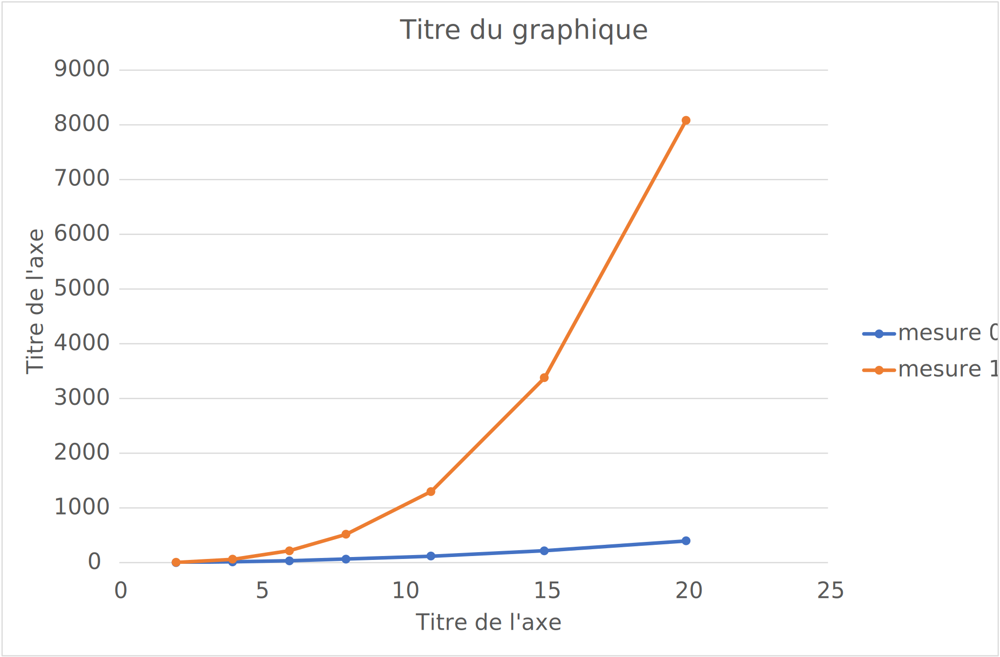

# L1 - Complexité

Editez ce fichier au format [markdown](https://github.com/adam-p/markdown-here/wiki/Markdown-Cheatsheet) pour y écrire 
votre rapport. 

Il peut être divisé un plusieurs fichiers mais README.md doit en être le point d'entrée. 

Il doit inclure des liens vers les données au format csv produites par votre code. Le fichier [example.csv](csv/example.csv) 
vous en fournit un exemple.

Il doit inclure des graphiques au format svg produit - par exemple par excel - à partir de ces 
données et illustrant votre analyse, comme les 2 exemples ci-dessous. 

